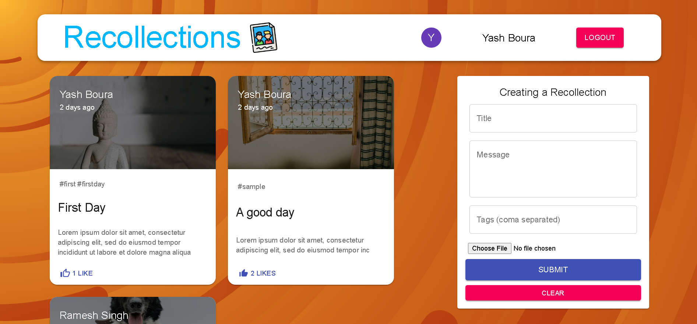

# Recollection
Simple social media app that allows users to share their memories with images and descriptions. It has user authentication via email(JWT) and Google OAuth


## Home Page

&nbsp;


Setup:
- run ```npm i && npm start``` for both client and server side to start the app
